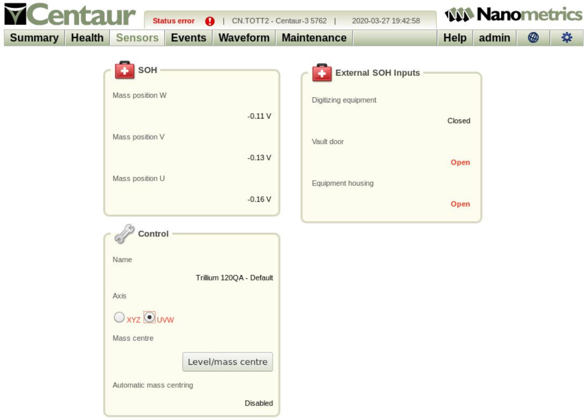
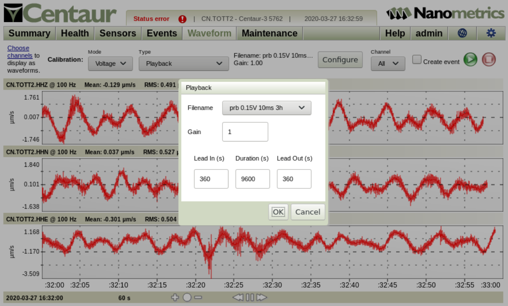
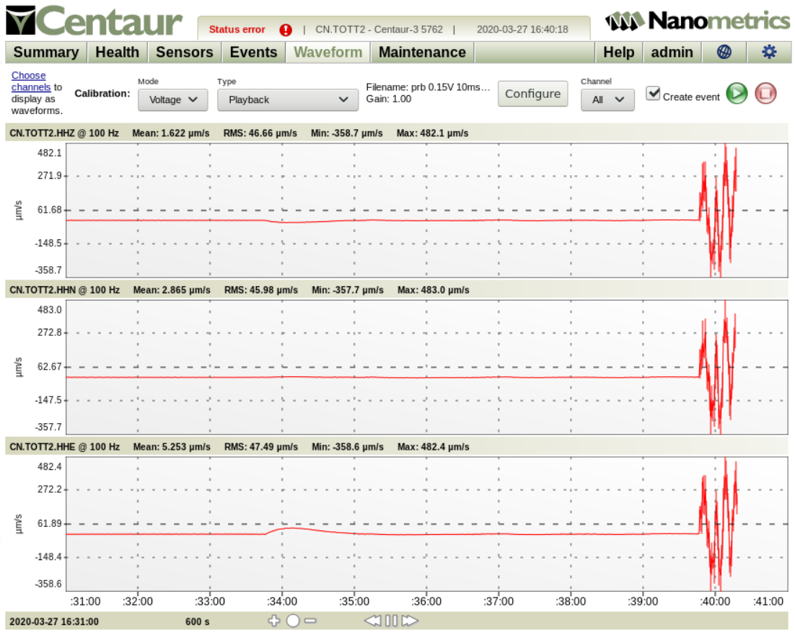
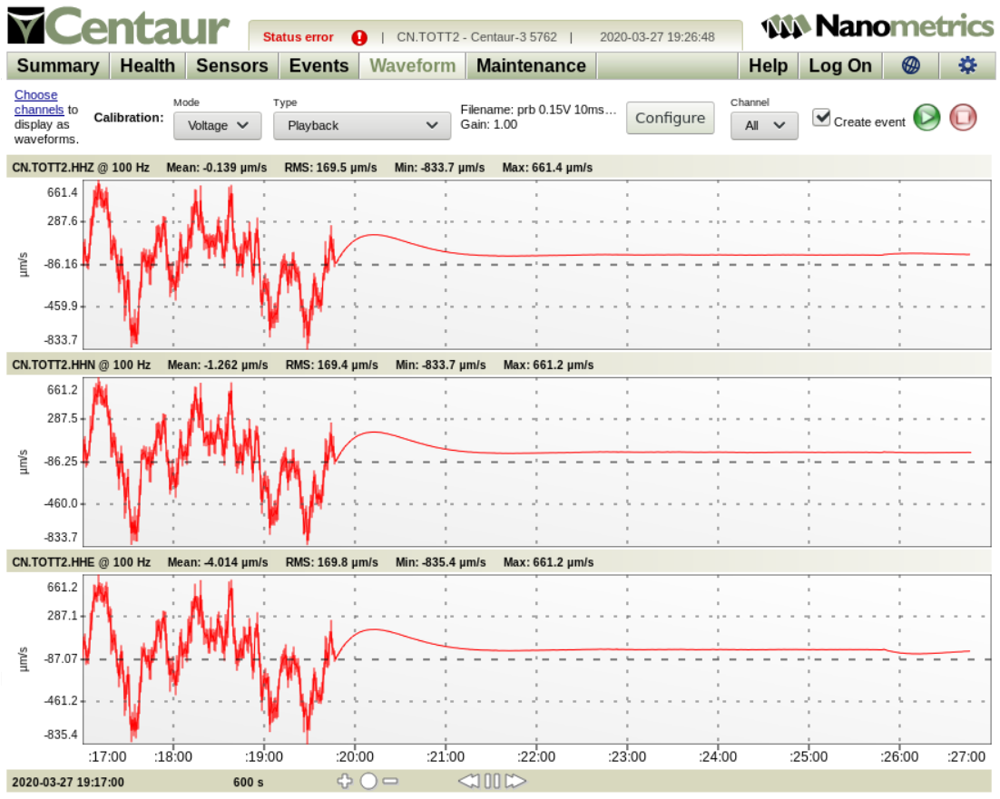
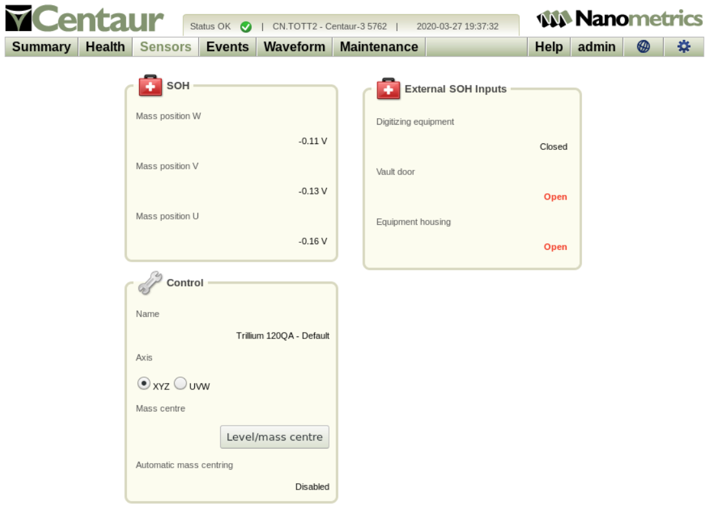
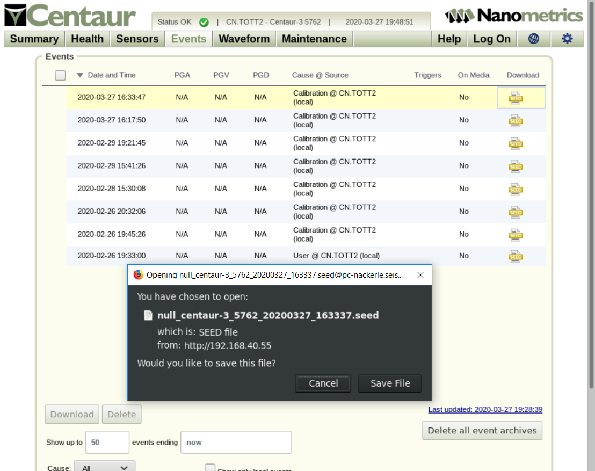
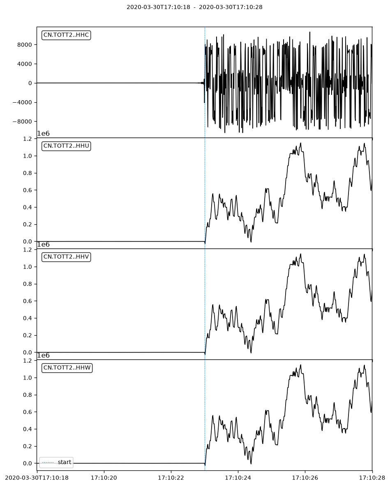
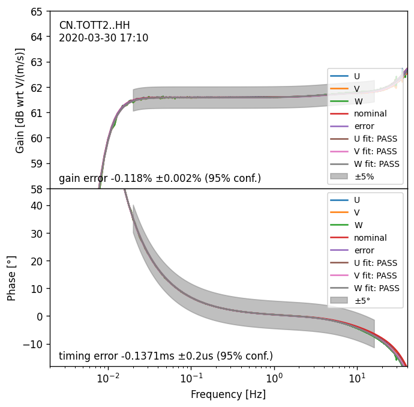
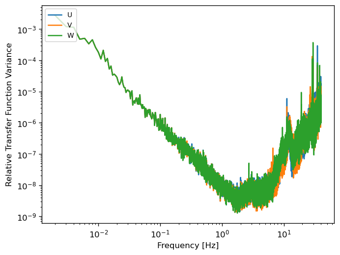

# Arbitrary Calibration Example

This example documents the full procedure for calibration of a seismometer
using a Nanometrics Centaur digitizer and `arbitrary_analyzer` from the
`calan` package.

The procedure is simpler with other digitizers, e.g. Guralp, that generate
calibration input signals themselves, and include them with downloaded
calibration waveforms. For such digitizers, the signal generation and upload
steps may be skipped, and the remaining procedure is largely the same.

## Contents

* [Generation](#generation)
* [Upload](#upload)
* [Execution](#execution)
* [Analysis](#analysis)

## Generation

Scripts for generating arbitrary calibration signals are generally obtained
from the manufacturer.
The latest scripts which come with the Nanometrics Centaur are archived here:

* [create_calibration_signal.py](create_calibration_signal.py) - for sine and step calibrations
* [create_seismometer_prb_calibration_signal](create_seismometer_prb_calibration_signal) - for pseudo-random binary calibrations

For example, to generate the recommended broadband calibration signal for a
Trillium 120:

```bash
bash create_seismometer_prb_calibration_signal --voltage=1 --duration=9600 --unit-width=10 --output=prb_1V_10ms_3h.lzma --lzma --meta
```

Note:

1. This produces an additional medatata file prefixed with
[\.meta\_](.meta_prb_1V_10ms_3h.lzma) which is used to communicate the length
of the calibrattion signal to the digitizer without it having to decompress
and read the data file.

2. The amplitude given in the example is suitable for a broadband seismometer with sensitivity 1000-1500 V/(m/s)
connected to a datalogger with full-scale voltage of 40 Vpp.
For higher sensitivities or equivalently lower full-scale voltages, the amplitude must be reduced.

## Upload

To copy all calibration files in a given directory to a Centaur:

```bash
scp -p 22 {*,.[^.]*,..?*}.lzma calibration@192.168.XXX.YYY:/usr/share/nanometrics/calibration
```

## Execution

<!-- markdownlint-disable MD033 -->

Open the Centaur GUI and log in. Note that it is only switching between UVW
and XYZ modes which requires elevated privileges, not calibration itself.
To run a calibration:

1. Download the channel response metadata in RESP format to an
appropriately-named folder for subsequent calibration analysis.

2. On the Sensor tab, toggle "Control ... Axis" to "UVW".
Note that the "Status" changes to "error":

    <p><a href="UVW.PNG"></a></p>

3. On the Waveform tab, after setting the calibration mode to "Voltage" and
the calibration type to "Playback", "Configure" the calibration, as follows
    a. Select the desired file (note that file name extensions are stripped
    and underscores are converted to spaces)
    b. Set the lead-in and lead-out times. Setting the lead-in to 3x the
    lower corner period ensures that the calibration signal is not disturbed by the calibration circuit turn-on transient.
    c. Do not change the gain or duration.

    <p><a href="PlaybackConfiguration.PNG"></a></p>

4. On the Waveform tab, ensure that "Create event" is enabled for "All"
channels and hit the "Play" button to initiate the calibration.
You will see an initial transient when the calibration circuit is turned on,
followed by the calibration signal itself, after the configured lead-in time.

    <p><a href="Start.PNG"></a></p>

5. Wait for the calibration to complete.

    <p><a href="End.PNG"></a></p>

6. On the Sensor tab, and toggle "Control ... Axis" to "UVW".
This returns the "status" to "OK".

    <p><a href="XYZ.PNG"></a></p>

7. On the "Events" tab, select and download the calibration event as the
response metadata.

    <p><a href="Event.PNG"></a></p>

## Analysis

### Documentation

See [arbitrary_analyzer.txt](arbitrary_analyzer.txt) for a recent archived
version of the documentation.

For the most current documentation, run:

```bash
arbitrary_analyzer --help
```

### Typical Usage

To analyze all files in a given folder (glob `pattern` default: `*.mseed`) and
produce basic plots of the results, use:

```bash
cd examples/SineCalibration
calan
```

This runs quickly, producing a summary table
[arbitrary_analyzer.csv](arbitrary_analyzer.csv)
and a log file
[arbitrary_analyzer.log](arbitrary_analyzer.log).

The files in this example folder were generated using:

```bash
arbitrary_analyzer --write-ims --plot diagnostic
```

To generate basic plots of the calibration result, use `--plot basic` flag, and
for more detailed information use `--plot diagnostic`.
Creation of plot image files slows processing down, so typically only `basic` are used.
An IMS2.0 format `CALIBRATE_RESULT` message is generated by `--write-ims`.:

### Basic Plotting

The `check_start` plot is used to ensure that the start time has the expected
time offset with respect to the start of the input waveform files:

<p><a href="check_start_CN.TOTT2..HH_20200330.1704.png"></a></p>

The `--delay-start` flag can be used to make adjustments as needed.
Note that with a Centaur the calibration and the resulting event waveform file
will always start exactly on an integer second, so it should only ever be
necessary to make small integer adjustments using this parameter.

The `transfer_function_nominal_cal_removed` plot shows the sensor transfer
function, that is, the calibration transfer function divided by the nominal
calibration response:

<p><a href="transfer_function_nominal_cal_removed_estimate_errors_CN.TOTT2..HH_20200330.1704.png"></a></p>


Note that pass/fail test limits and results are indicated in the legend.

The `transfer_function_nominal_system_removed` plot shows most clearly how
the system deviates from the nominal transfer function:

<p><a href="transfer_function_nominal_system_removed_estimate_errors_CN.TOTT2..HH_20200330.1704.png"></a></p>

The `variance` plot shows the expected squared error in the magnitude and
phase of the transfer function estimate.

<p><a href="variance_CN.TOTT2..HH_20200330.1704.png"></a></p>

This plot can be useful for troubleshooting calibrations which are spoiled by
transient disturbances.

### Advanced Plotting and Start Time Correction

Sometimes certain digitizers fail to start the calibration at the expected time.
In many cases, the calibration results are still usable.

1. Note the timing error estimate reported in the log-file or read it from one of the the `correct_errors` plots.

2. Re-run the analysis with `--delay-start` set to the estimated value.
