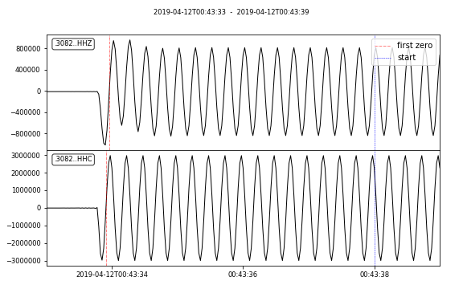
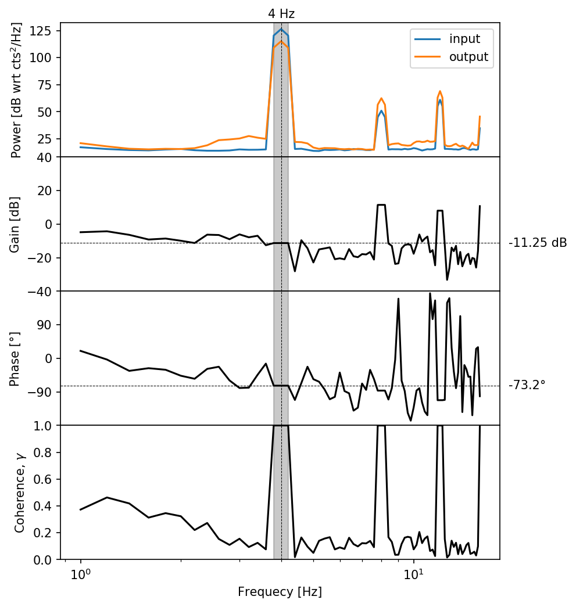

# Sine Calibration Example

For help and options, see:
```bash
sine_analyzer --help
```

To analyze all files in a given folder, use:
```bash
cd examples/SineCalibration
sine_analyzer
```
This runs quickly, producing a summary table [sine_analyzer.csv](sine_analyzer.csv) and a log file [sine_analyzer.log](sine_analyzer.log).

To generate diagnostic plots, add the `--plot` flag:
```bash
sine_analyzer --plot
```

This produces zoomed plots of the start and end of the time series:


It also produces a summary of the input and output power spectra, estimated transfer function gain and phase, and coherence as a function of frequency:


